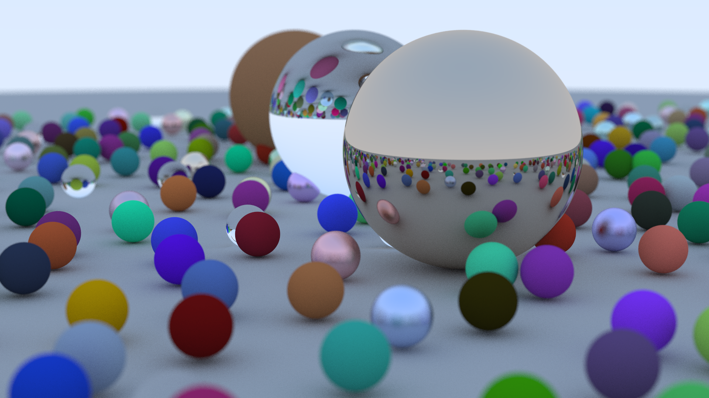

# C++ Ray Tracer

A multithreaded CPU ray tracer written in C++. This project is an implementation of Peter Shirley's [*Ray Tracing in One Weekend*](https://raytracing.github.io) series, expanded with a CMake build system, compiler optimization, and OpenMP integration for parallel rendering.

## Prerequisites
To build and run this project, you will need a Linux environment with the following installed:
* A modern C++ compiler (GCC or Clang)
* CMake (Version 3.10 or higher)
* OpenMP (usually bundled with GCC)

## Build Instructions

This project uses an out-of-source CMake build to keep the workspace clean. To configure and compile the project in `Release` mode (which applies the necessary performance optimizations):

```bash
# Configure the build directory
cmake -DCMAKE_BUILD_TYPE=Release -B build

# Enter the build directory
cd build

# Compile the executable
cmake --build .
```

## Running & Profiling the Render
Once compiled, you can run the executable and pipe the output to a `.ppm` image file.

The project uses the [`aminnj/cpptqdm`](https://github.com/aminnj/cpptqdm) header to show the progress bar and benchmark the total render time.

From inside the `build` directory, run the following one-liner to compile, execute the render, measure the elapsed time in seconds, and automatically open the resulting image:

```bash
cmake --build . && ./RayTracer > image.ppm && xdg-open image.ppm
```

## Project Structure
* `src/` - Contains the main execution logic and C++ source files.

* `include/` - Contains all class headers (`vec3.h`, `ray.h`, `camera.h`, etc.).

* `CMakeLists.txt` - Build system configuration and compiler flags.

## Rendered scene

